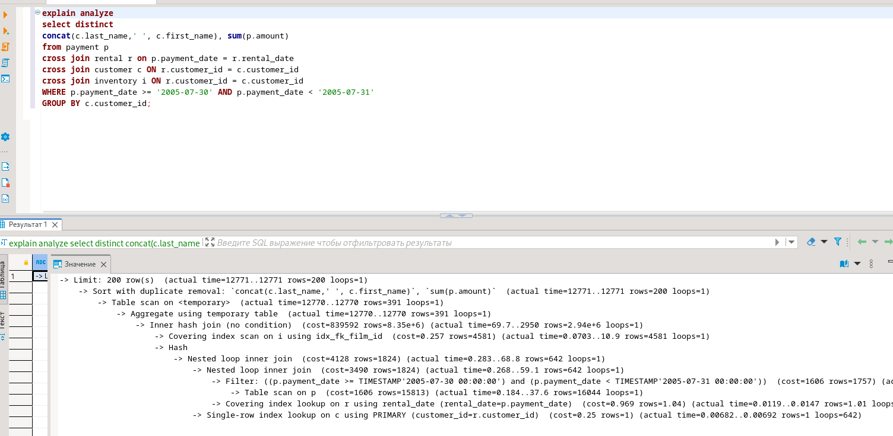

# hw_12-05_items  
items  

Задание 1  
Напишите запрос к учебной базе данных, который вернёт процентное отношение общего размера всех индексов к общему размеру всех таблиц.  
  
SELECT (SUM(INDEX_LENGTH) / SUM(DATA_LENGTH)) * 100 AS индекс_К_табл  
from information_schema.TABLES  
WHERE TABLE_SCHEMA = 'sakila';  

  Задание 2  
Выполните explain analyze следующего запроса:  
  
explain analyze  
select distinct concat(c.last_name, ' ', c.first_name), sum(p.amount) over (partition by c.customer_id, f.title)  
from payment p, rental r, customer c, inventory i, film f  
where date(p.payment_date) = '2005-07-30' and p.payment_date = r.rental_date and r.customer_id = c.customer_id and i.inventory_id = r.inventory_id;  
  
  перечислите узкие места;   
  оптимизируйте запрос: внесите корректировки по использованию операторов, при необходимости добавьте индексы  

explain analyze  
select distinct   
concat(c.last_name,' ', c.first_name), sum(p.amount)  
from payment p   
cross join rental r on p.payment_date = r.rental_date  
cross join customer c ON r.customer_id = c.customer_id   
cross join inventory i ON r.customer_id = c.customer_id   
WHERE p.payment_date >= '2005-07-30' AND p.payment_date < '2005-07-31'  
GROUP BY c.customer_id;  

  
